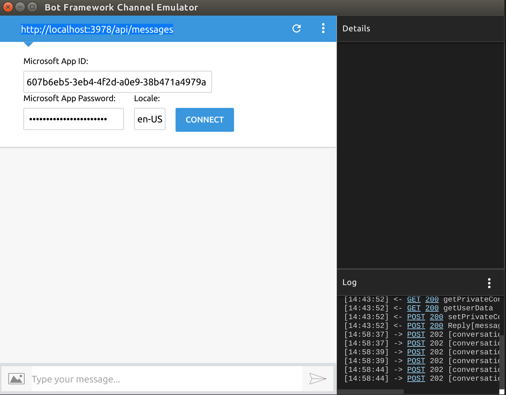

# Attendance

Attendance is a chat bot application which allows employees to take a day off in an easy and comfortable way.
The goal of this project is automating that process.

## Run the app:

Clone repository and use node and npm versions in package.json file, install them if not already installed.

1. `npm install`
2.  Prepare `settings.json` file (use `settings.json.example` as a template)
3. `npm run start-locally`

Emulator must be running in the separate terminal.
[Download, build and run Bot-framework emulator] 
(https://github.com/Microsoft/BotFramework-Emulator/releases)
The easiest way is to simply load Source code 3.5.27 (tar.gz)
and build it with the following steps:

1. `npm install`
2. `npm run build`
3. `npm run start`

If have troubles with tar.gz from GitHub download,
botframework-emulator-3.5.27-mac.zip for MacOS and
[this one](https://goo.gl/eWAtH5) for other platforms.

The next thing that should be done is putting app ID and password into emulator window
  appId: "XXXXXXXX-XXXX-XXXX-XXXX-XXXXXXXXXXXX"
  appPassword: "XXXXXXXXXXXXXXXXXXXXXX"

## Basic workflow:

We use BDD methodology while developing the app.
(https://www.toptal.com/freelance/your-boss-won-t-appreciate-tdd-try-bdd)

Make sure you follow eslint rules
(http://eslint.org/docs/rules/)

Commits with eslint errors are disabled.

When you are assigned on the new task:
1. Create separate branch forked from development. The name of the branch should appropriate a task meaning.
2. When you all done with a task create PR. Left the comment with a task description or link to task. And ask other developers
to test it.
3. Every task should have tests covering.
4. Approved PR is merged to development.
5. development branch is tested by QA
6. development branch is merged to master

## Troubleshooting
If have troubles with compiling Typescript files in BotFramework-Emulator change typescript version in package.json to "2.2.2".

## Writing tests
We use mocha as a test runner and chai assertion library.
Take a look at the following resources: 
1. https://blog.risingstack.com/node-hero-node-js-unit-testing-tutorial/
2. https://mochajs.org/
3. http://chaijs.com/

## Running tests
To run all tests:
1. `npm test`

If you want add your own test, make a file "./test/fileName.js",
where you can write functional, which you want to test.

## Deploy Attendance:
1. `npm run deploy`

## Test Data
1. to fill db with test user, admin and events run project with createUser flag
 `npm run start-locally createUser`

## Test bot in skype
You can add bot to your skype through this link
https://join.skype.com/bot/79dc72c7-dc9b-43f6-9833-d12c0771f89b

## Troubleshooting
If bot doesn't reply you ( probably because your user has been removed from the database but bot still store your profile data in it's own state) - just type 'goodbye'. It will terminate your current dialog.
If your use has admin role in db but bot still treat you as a user - type "i am admin". It will update bot application state
